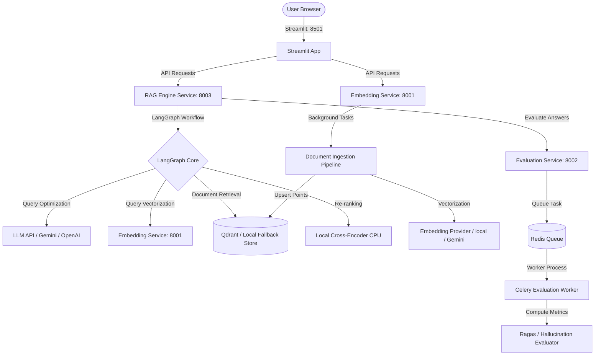

# RAGOps Platform

An enterprise-grade, multi-tenant RAG (Retrieval-Augmented Generation) operations platform featuring a self-correcting agentic loop, multi-query parallel expansion, Cross-Encoder re-ranking, and dynamic fallback databases.

---

## 🚀 Quick Start

### 1. Prerequisites
- **Python**: v3.10+ (v3.11/v3.12 recommended)
- **Redis**: Running local Redis server or remote URL (for Celery background tasks)

### 2. Installation
Create and activate your virtual environment, then install dependencies:
```powershell
python -m venv .venv
.venv\Scripts\Activate.ps1
pip install -r requirements.txt
```

### 3. Setup Configuration
Create a `.env` file in the root directory:
```env
GEMINI_API_KEY=your_gemini_api_key_here
EMBEDDING_PROVIDER=local
LOCAL_MODEL=all-MiniLM-L6-v2
QDRANT_URL=http://localhost:6333
QDRANT_API_KEY=
```

### 4. Running the Platform
Start the backend microservices and frontend dashboard concurrently:
```powershell
python run_backend.py
```
This runs the following stack:
- **Auth Service**: `http://localhost:8000`
- **Embedding Service**: `http://localhost:8001`
- **Evaluation Service**: `http://localhost:8002`
- **RAG Engine Service**: `http://localhost:8003`
- **Celery Worker**: Evaluates responses in the background.
- **Streamlit Dashboard**: `http://localhost:8501`

---

## 🛠️ Architecture Overview

For a deep-dive into the architectural details, database schemas, and service-to-service communication, refer to the [Platform Documentation](docs/README.md) and the [Project Detailed Report](docs/project_report.md).



---

## 🌟 Key Features

1. **Agentic Self-Correction Loop**: Validates generation output for faithfulness using a dedicated evaluator node. If hallucinations are flagged, the graph loops back and queries the retriever again with rewritten parameters.
2. **Advanced RAG (Multi-Query, Parallelism, & Re-ranking)**:
   - **Multi-Query Expansion**: LLM rewrites query into 3 semantic facets.
   - **Parallel Retrieval**: Asynchronous async vector lookup for all variations.
   - **Cross-Encoder Re-ranking**: Relevance scoring utilizing a local Cross-Encoder model.
3. **Local-First Executions**: Fallback to local SentenceTransformer embeddings, CPU-based Cross-Encoder, and local JSON files for storing vector indexes when remote connections are offline.
