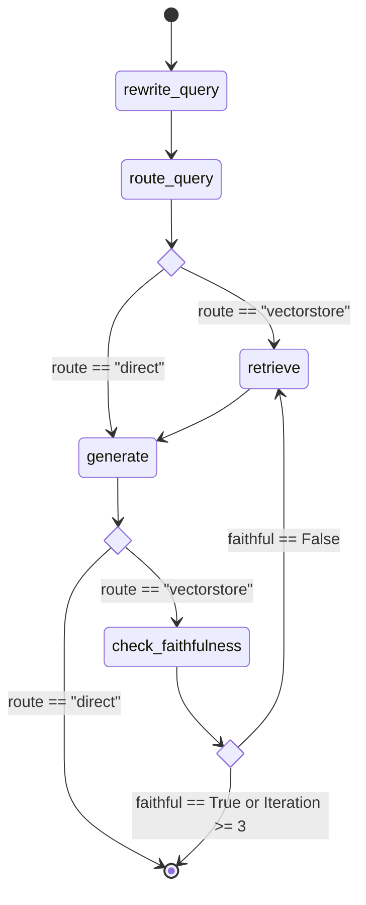

# RAGOps Architecture & Service Documentation

This directory contains technical specifications for the developers of the RAGOps platform. For a complete summary of the system upgrades, design rationale, and logs, refer to the [Project Detailed Report](project_report.md).

---

## 1. Design & Core Philosophy

RAGOps follows a **Domain-Driven Design (DDD)** structure split into bounded contexts:

- **Identity & Access**: Managed by the [Auth Service](file:///d:/ragops/services/auth) to enforce tenant validation.
- **Ingestion & AI Infra**: Managed by the [Embedding Service](file:///d:/ragops/services/embedding) to parse raw documents, clean transcripts, generate embeddings, and insert points.
- **Orchestration**: Managed by the [RAG Engine Service](file:///d:/ragops/services/rag-engine) to handle LangGraph states.
- **Evaluation**: Managed by the [Evaluation Service](file:///d:/ragops/services/evaluation) to score pipeline execution.

---

## 2. Advanced Retrieval-Augmented Generation Flow

The retrieval engine implements advanced strategies to bypass the limitations of naive vector lookup:

### Query Optimization
1. **Query Rewriter**: Strips conversational fluff and translates pronoun references prior to lookup.
2. **Multi-Query Expansion**: Generates 3 alternative perspectives of the input query.

### Parallel Vector Lookup
Instead of sequential lookup, query variations run in parallel (`asyncio.gather`), fetching matching contexts across active namespaces inside:
- Qdrant Vector database collections: `{tenant_id}__documents`
- Or local fallback: `local_vector_store.json`

### Fusion, Deduplication, & Re-ranking
- **Deduplication**: Filters out duplicate text chunks by content hashing.
- **Cross-Encoder Re-ranking**: Executes semantic similarity scoring against the user's original query using `cross-encoder/ms-marco-MiniLM-L-2-v2`.
- **Top K Selection**: Filters and extracts the highest-scoring candidate chunks.

### Agentic Faithfulness Guard
The RAG pipeline compiles into a self-evaluating state machine:

---

## 3. High Performance Local Offloading

To ensure local performance on CPU-only machines:
1. **Model Cache**: Class-level caches in embedding and Cross-Encoder factories prevent reloading models on every request.
2. **Non-Blocking Threadpool**: CPU-heavy encoders are delegated to background executors (`asyncio.run_in_executor`) to avoid blocking async network requests.
3. **Mismatched Embeddings Safe-guarding**: Checks query vector vs. stored vector dimensions, automatically filtering out mismatch errors (e.g., matching 1536-dim vs. 384-dim vectors).