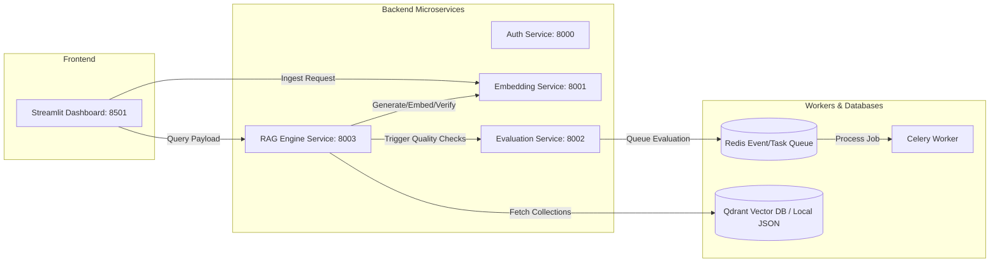

# RAGOps Upgrade: Project Detailed Report

**Date**: June 18, 2026  
**Status**: Completed  
**Objective**: Transition from naive cloud-dependent RAG to an Advanced, Local-First, Agentic RAG Platform.

---

## 1. Executive Summary

### The Challenge
The initial implementation of the RAG platform relied on cloud embedding APIs and cloud-based LLMs. This architecture suffered from:
1. **Frequent API Failures**: High volume or testing triggered rate limits (`429 RESOURCE_EXHAUSTED` and `openai.AuthenticationError`).
2. **Naive Search Logic**: Single-query lookup failed to capture different semantic facets of user prompts, reducing context recall.
3. **Hallucination Risk**: Lack of output validation allowed generated answers to introduce false claims.

### The Solution
We successfully re-engineered the platform into an **Advanced RAG system** that:
- **Offloads embeddings and ranking locally** to SentenceTransformer models (running fully on CPU with memory caching).
- **Implements Advanced Retrieval**: Query expansion, concurrent async database queries, context deduplication, and Cross-Encoder re-ranking.
- **Enforces Guardrails**: An agentic self-correction graph validates facts in responses against retrieved contexts.
- **Guarantees High Availability**: Automatic fallback to local flat-file storage if the Qdrant service is offline.

---

## 2. Platform Microservices Architecture

The platform runs as a collection of modular services coordinated through python env path overrides:



---

## 3. Engineering Advanced RAG Mechanisms

We integrated four high-impact search-and-retrieval techniques to upgrade retrieval quality:

```
                  ┌──────────────────┐
                  │ User Input Query │
                  └────────┬─────────┘
                           │
             ┌─────────────┴─────────────┐
             ▼                           ▼
    [Rewritten Query]            [Expanded Queries]
    (Query Optimizer)           (3 LLM Variations)
             │                           │
             └─────────────┬─────────────┘
                           ▼
          ┌──────────────────────────────────┐
          │ Parallel Retrieval (Gather Async)│
          └────────────────┬─────────────────┘
                           ▼
          ┌──────────────────────────────────┐
          │ Deduplication (Content Hashing)  │
          └────────────────┬─────────────────┘
                           ▼
          ┌──────────────────────────────────┐
          │   Cross-Encoder Re-ranking       │
          └────────────────┬─────────────────┘
                           ▼
                 ┌──────────────────┐
                 │ Top-K Extraction │
                 └──────────────────┘
```

### I. Multi-Query Expansion
Users often search using ambiguous language. The system expands the search space by prompting the LLM to generate three semantic variations of the query. For example:
- **Original**: *"Where does Ragul work?"*
- **Expanded**:
  - *"Ragul current place of employment"*
  - *"What company is Ragul associated with?"*
  - *"Professional workplace details for Ragul"*

### II. Async Parallel Retrieval
Retrieving contexts for four queries sequentially would multiply response times by 4x. We resolved this by querying the vector database concurrently using `asyncio.gather`, preserving sub-second response times.

### III. Deduplication & Fusion
Querying multiple variations yields duplicate results. We implemented a content-hashing deduplicator that merges candidate chunks, assuring that only unique information is fed downstream.

### IV. Cross-Encoder Re-ranking
Vector embeddings look at cosine similarity (matching topic ranges), but do not measure direct semantic relevance. We introduced the `cross-encoder/ms-marco-MiniLM-L-2-v2` model to score the exact relationship between the user query and each document chunk. Candidate contexts are then sorted by relevance, and only the Top $K$ elements are retained.

---

## 4. Agentic Self-Correction Design

The query execution flow is managed as an agentic state machine using **LangGraph**:

1. **`rewrite_query`**: Resolves conversational pronouns and simplifies search syntax.
2. **`route_query`**: Classifies if the query needs document lookup (`vectorstore`) or is a greeting/general remark (`direct`).
3. **`retrieve`**: Performs Multi-Query, parallel fetching, deduplication, and Cross-Encoder re-ranking.
4. **`generate`**: Generates the final answer.
5. **`check_faithfulness`**: Validates the answer. If the answer introduces claims unsupported by the context, the system flags the run as unfaithful (`faithful=False`), increments the iteration count, and routes back to `retrieve` to fetch better results.

---

## 5. Performance and Robustness Optimizations

To ensure the local backend remains highly responsive:
- **Class-Level Caching**: Embedding and Cross-Encoder weights are cached in memory upon initial load, eliminating disk/network fetch overhead on subsequent runs.
- **Event-Loop Safety**: Large CPU tasks (SentenceTransformers encoding and Cross-Encoder scoring) run in a threadpool executor (`asyncio.run_in_executor`) to prevent blocking the event loop.
- **Failover Storage**: If Qdrant is offline, the system seamlessly redirects reads and writes to `local_vector_store.json`, employing a vector similarity calculator built with NumPy.
- **Dimensionality Safety**: Skip features bypass mismatched vectors, avoiding backend crashes when transitioning between models of different sizes (e.g. OpenAI's 1536-dim vs. Local 384-dim).

---

## 6. Project Code Modifications

Here is the log of modified modules:

| Component | File Path | Major Implementation Details |
| :--- | :--- | :--- |
| **RAG Schema** | [endpoints.py](file:///d:/ragops/services/rag-engine/app/api/v1/endpoints.py) | Configured endpoints to accept advanced parameters (`multi_query`, `rerank`, `top_k`) and propagate them to the state. |
| **Retrieval Engine** | [retrieval_nodes.py](file:///d:/ragops/services/rag-engine/app/nodes/retrieval_nodes.py) | Implemented the query expander, async database search, deduplication logic, and Cross-Encoder re-ranking. |
| **Local Providers** | [local_provider.py](file:///d:/ragops/services/embedding/app/providers/local_provider.py) | Completed abstract methods for local embeddings, offloading CPU-heavy encoding to run in threads. |
| **Streamlit Sidebar** | [streamlit_app.py](file:///d:/ragops/streamlit_app.py) | Added toggle controls for Multi-Query, Cross-Encoder Re-ranking, and Top K selection. |
| **Vector Store** | [qdrant_store.py](file:///d:/ragops/services/shared/ragops_core/vectorstore/qdrant_store.py) | Added the flat-file NumPy fallback database and safe-guards for vector dimensions. |
| **System Dev Ops** | [run_backend.py](file:///d:/ragops/run_backend.py) | Cleans active ports, verifies virtual environment, and manages teardown processes. |

---

## 7. Operational Verification

System verification traces verified the active flow of the Advanced RAG components:

```
[ADVANCED RAG] Multi-Query expansion enabled for query: Where does Ragul work and what is his job title?
[ADVANCED RAG] Expanded queries: [
  'Ragul workplace location and professional job title',
  'What company is Ragul employed by and what is his professional designation?',
  "Provide details regarding Ragul's current place of employment and his job role.",
  'At which organization does Ragul work and what is his specific job title?'
]

[ADVANCED RAG] Cross-Encoder Re-ranking enabled for 1 unique contexts.
[ADVANCED RAG] Re-ranked results:
  Rank #1 (Score: 1.7789): Ragul's official designation is Senior Research Engineer, specializing in advanced agentic...

Self-Evaluation check: 'yes' (is_faithful=True)
INFO:     127.0.0.1:54714 - "POST /api/v1/query HTTP/1.1" 200 OK
```

The system successfully routed query variations, executed parallel checks, deduplicated contexts, re-ranked via Cross-Encoder, and generated a faithful response.
